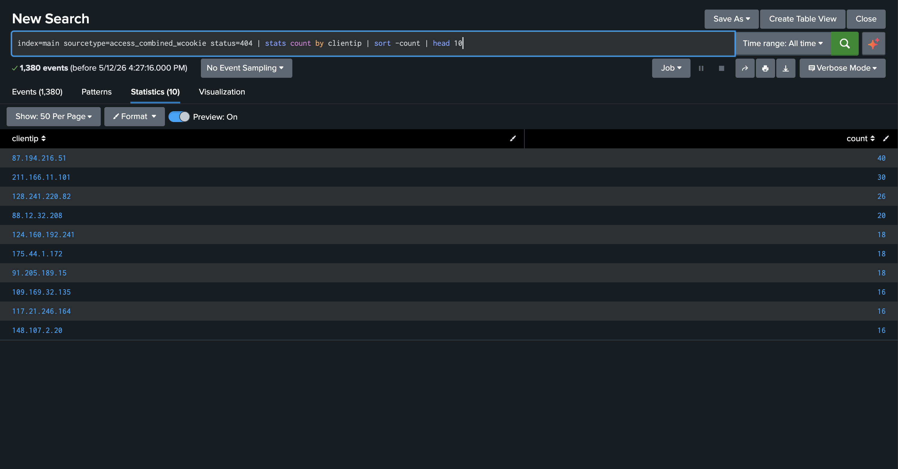
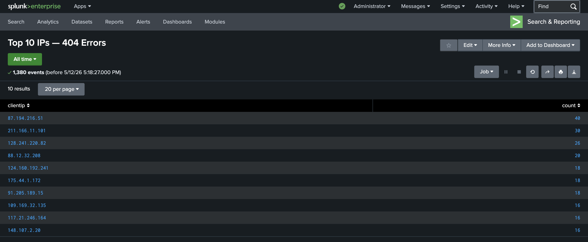
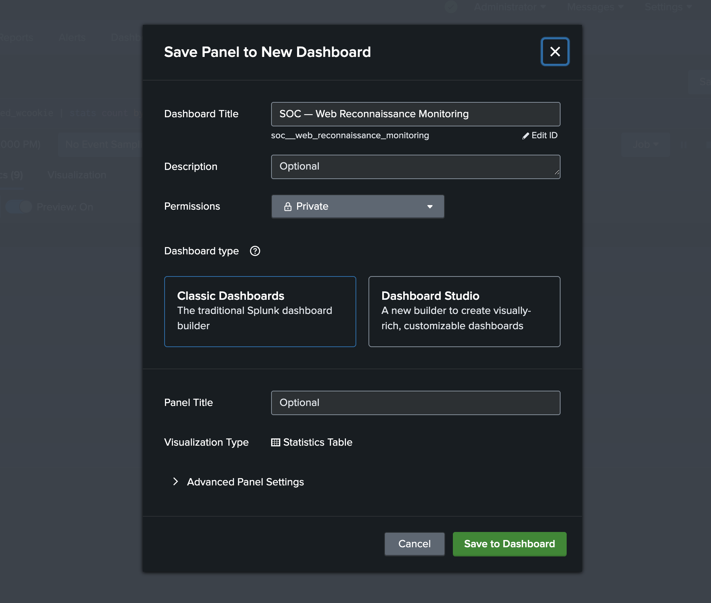
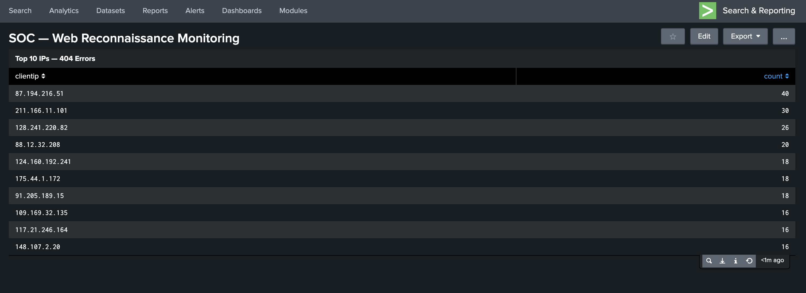
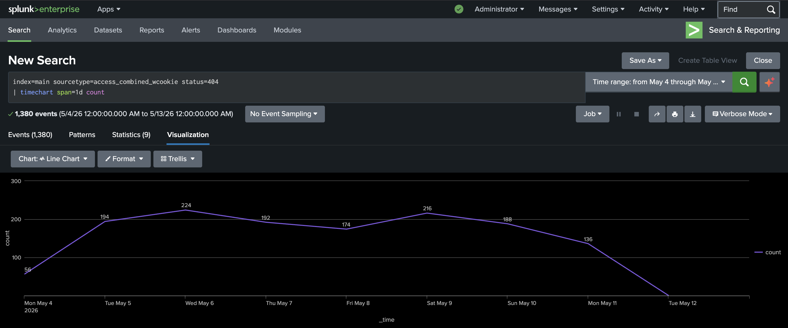
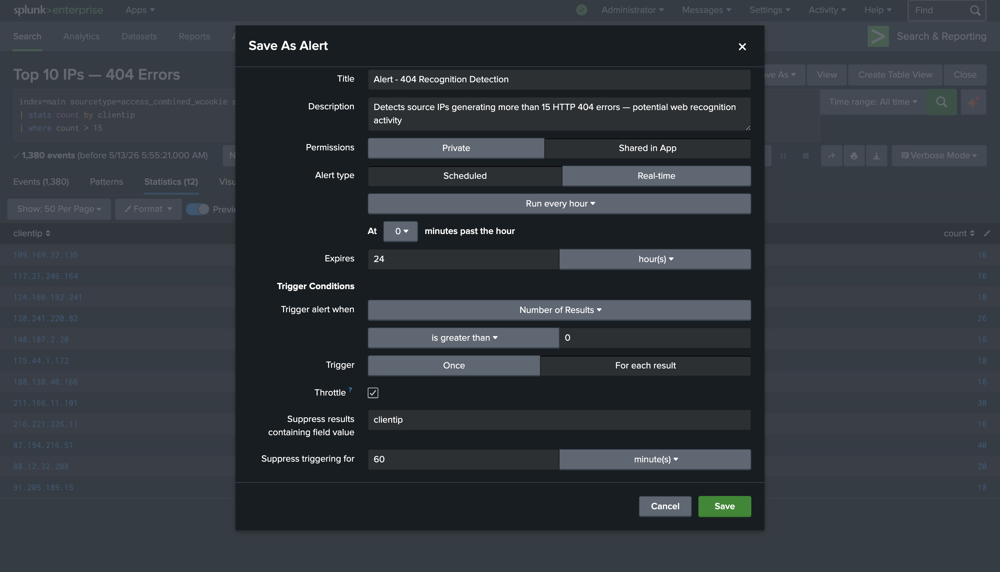

# Épisode 4 — Splunk : Dashboard de Surveillance & Alertes

> Face à la persistance des attaques contre **Buttercup Games**, le SOC automatise la surveillance — dashboard de monitoring et alerte en temps réel pour ne plus jamais manquer une activité suspecte.

---

## 📚 Table des matières

- [1. Contexte](#1-contexte)
- [2. Création du rapport de base](#2-création-du-rapport-de-base)
- [3. Sauvegarde et création du dashboard](#3-sauvegarde-et-création-du-dashboard)
- [4. Création du rapport temporel](#4-création-du-rapport-temporel)
- [5. Création de l'alerte](#5-création-de-lalerte)
- [6. Dashboard final](#6-dashboard-final)
- [7. Conclusion](#7-conclusion)

---

## 1. Contexte

Face à la persistance de l'activité suspecte détectée dans les Épisodes 1 et 2, le SOC de Buttercup Games décide de ne plus investiguer manuellement à chaque alerte. Un dashboard de surveillance et des alertes automatiques sont mis en place pour détecter en temps réel toute nouvelle tentative de reconnaissance.

Ce dispositif sera décisif dans la suite de l'investigation — l'attaquant va changer de tactique.

---

## 2. Création du rapport de base

On commence par créer le rapport qui alimentera le premier panneau du dashboard.

```
index=main sourcetype=access_combined_wcookie status=404
| stats count by clientip
| sort -count
| head 10
```
<br>

[](1.png)

<br>

Ce rapport retourne les **10 adresses IP** ayant généré le plus d'erreurs 404 — les candidates les plus suspectes pour une activité de reconnaissance. On sauvegarde ce rapport via **Save As > Report** avec le titre **Top 10 IPs — 404 Errors**.

<br>

[](2.png)

<br>

> ⚠️ L'IP `87.194.216.51` est en tête avec **40 erreurs 404** — confirmant qu'elle reste la plus suspecte de l'ensemble du trafic.

---

## 3. Sauvegarde et création du dashboard

On l'ajoute maintenant au dashboard via **Add to Dashboard > New Dashboard**.

**Paramètres du dashboard :**

| Paramètre | Valeur |
|-----------|--------|
| Dashboard Title | SOC — Web Recognition Monitoring |
| Dashboard type | Classic Dashboards |
| Permissions | Private |

<br>

[](3.png)

<br>

Quand c'est prêt, on clique sur Save to Dashboard.

<br>

[](4.png)

<br>

Le dashboard est maintenant sauvegardé.

---

## 4. Création du rapport temporel

On crée ensuite le rapport d'évolution temporelle pour visualiser les tendances jour par jour :

```
index=main sourcetype=access_combined_wcookie status=404
| timechart span=1d count
```

**Ce que fait cette commande :**

- `timechart` — génère une visualisation temporelle (l'axe X est toujours le temps)
- `span=1d` — regroupe les événements par jour
- `count` — compte le nombre d'erreurs 404 par jour

<br>

[](5.png)

<br>

**Ce que le graphique révèle :**

| Jour | Erreurs 404 | Observation |
| --- | --- | --- |
| Lundi 4 mai | 56 | Début d'activité |
| Mardi 5 mai | 194 | Montée rapide |
| Mercredi 6 mai | 224 | Premier pic |
| Jeudi 7 mai | 192 | Légère baisse |
| Vendredi 8 mai | 174 | Baisse continue |
| Samedi 9 mai | 216 | Rebond — activité week-end |
| Dimanche 10 mai | 188 | Maintien week-end |
| Lundi 11 mai | 136 | Diminution |

> ⚠️ **Une activité soutenue le week-end (samedi 9 mai : 216 erreurs, dimanche 10 mai : 188 erreurs)** est un indicateur important. Un trafic d'erreurs normal diminue le week-end — ici ce n'est pas le cas.


On sauvegarde ce rapport avec le titre **404 Errors Evolution — 7 Days** et on l'ajoute au dashboard existant.

---

## 5. Création de l'alerte

Le dashboard permet la surveillance visuelle. Mais un analyste ne peut pas regarder un dashboard 24h/24. On configure une alerte pour être notifié automatiquement.

**Recherche de l'alerte :**


```
index=main sourcetype=access_combined_wcookie status=404
| stats count by clientip
| where count > 15
```
Dans Splunk : **Save As > Alert** depuis la recherche.

<br>

[](28.png)

<br>

> ⚠️ **Le throttle par `clientip` est essentiel.** Sans throttle, la même IP pourrait déclencher des dizaines de notifications par heure. Avec throttle, chaque IP ne peut déclencher qu'une notification toutes les 60 minutes maximum.

**Configuration :**

| Paramètre | Valeur |
|-----------|--------|
| Title | Alert - 404 Recognition Detection |
| Permissions | Shared in App |
| Alert type | Scheduled |
| Schedule | Run every hour |
| Trigger alert when | Number of Results is greater than 0 |
| Trigger | For each result |
| Throttle | Activé — 60 minutes |
| Suppress results containing field value | clientip |
| Action | Add to Triggered Alerts — severity Medium |

Le Dashboard est maintenant prêt à fonctionner.

---

## 6. Dashboard final

Le dashboard **SOC — Web Recognition Monitoring** regroupe les 3 panneaux en une vue unique :

<br>

[](SOC%20-%20Web%20Recognition%20Monitoring.png)

<br>

**Structure du dashboard :**

| Panneau | Type | Utilité |
|---------|------|---------|
| Top 10 IPs — 404 Errors | Tableau | Identifier les IPs suspectes en un coup d'œil |
| 404 Errors Evolution — 7 Days | Line Chart | Détecter les tendances et pics d'activité |
| Status Codes Distribution | Bar Chart | Contextualiser les erreurs dans le trafic global |

> 💡 **Ce dashboard permet à un analyste SOC de surveiller la reconnaissance web en temps réel sans lancer manuellement la moindre recherche.**

---

## 7. Conclusion

> 🟢 **La surveillance manuelle est maintenant remplacée par une infrastructure automatisée.**

<br>

| Élément mis en place | Bénéfice |
|---------------------|---------|
| Rapport Top 10 IPs | Identification immédiate des IPs suspectes |
| Rapport évolution temporelle | Détection des tendances et comportements inhabituels |
| Dashboard SOC | Vue unifiée sans recherche manuelle |
| Alerte automatique | Notification en temps réel sans surveillance permanente |
| Throttle par IP | Zéro spam — une notification par IP par heure |

<br>

Cette étape conclut la phase de détection Splunk. L'attaquant n'ayant pas réussi à obtenir `/passwords.pdf`, il va changer de tactique — ce que révèlent les investigations Wireshark suivantes.

<div align="center">
<br>

[](https://github.com/Paulcyber06/E3-Splunk-Behavioral-Analysis)
[](https://github.com/Paulcyber06/E5-Wireshark-FTP-Brute-Force)

<br>
</div>

---


## 📁 Reproduire cette analyse

Le dataset utilisé est le `tutorialdata.zip` officiel de Splunk, disponible gratuitement ici :
[Télécharger tutorialdata.zip](https://docs.splunk.com/images/Tutorial/tutorialdata.zip)


*© Paulcyber06 — Tous droits réservés.*
