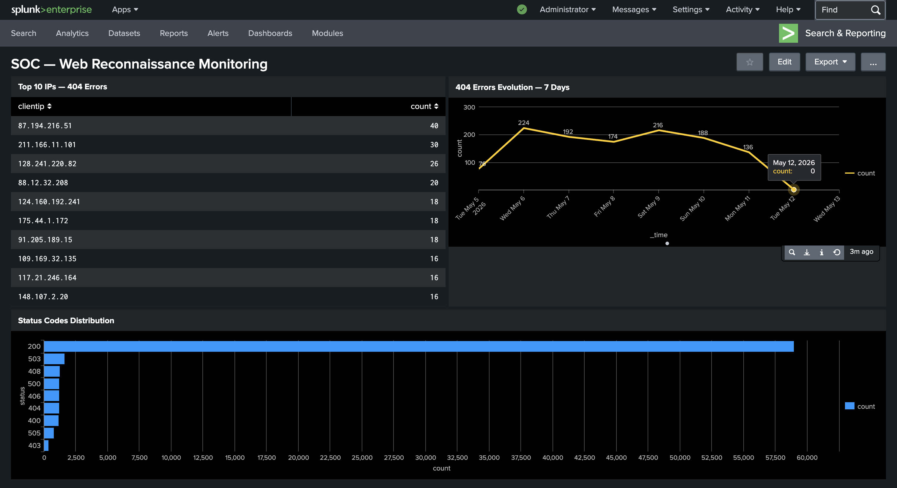

# SPL Basics — Épisode 3 : Dashboard de Surveillance & Alertes Automatiques

> Suite des Épisodes 1 et 2. Après avoir détecté une IP suspecte et analysé son comportement, nous allons maintenant mettre en place une **surveillance automatique** : un dashboard SOC et une alerte qui se déclenche sans intervention manuelle.

---

## 📚 Table des matières

- [1. Contexte](#1-contexte)
- [2. Création du rapport de base](#2-création-du-rapport-de-base)
- [3. Sauvegarde et création du dashboard](#3-sauvegarde-et-création-du-dashboard)
- [4. Création du rapport temporel](#4-création-du-rapport-temporel)
- [5. Création de l'alerte](#5-création-de-lalerte)
- [6. Dashboard final](#6-dashboard-final)
- [7. Conclusion](#7-conclusion)

---

## 1. Contexte

Dans les épisodes précédents, nous avons :

- **Épisode 1** — Détecté l'IP `87.194.216.51` en train de faire de la reconnaissance via des erreurs 404
- **Épisode 2** — Analysé son comportement complet : 894 accès réussis, double activité suspecte

Le problème : cette investigation a été **manuelle**. Dans un environnement réel, un analyste SOC ne peut pas lancer ces recherches manuellement à chaque heure.

La solution : **automatiser la surveillance** avec un dashboard et une alerte qui se déclenchent sans intervention humaine.

---

## 2. Création du rapport de base

On commence par créer le rapport qui alimentera le premier panneau du dashboard.

```
index=main sourcetype=access_combined_wcookie status=404
| stats count by clientip
| sort -count
| head 10
```

[](1.png)

Ce rapport retourne les **10 adresses IP** ayant généré le plus d'erreurs 404 — les candidates les plus suspectes pour une activité de reconnaissance. On sauvegarde ce rapport via **Save As > Report** avec le titre **Top 10 IPs — 404 Errors**.

[](2.png)

> ⚠️ L'IP `87.194.216.51` est en tête avec **40 erreurs 404** — confirmant qu'elle reste la plus suspecte de l'ensemble du trafic.

---

## 3. Sauvegarde et création du dashboard

On l'ajoute maintenant au dashboard via **Add to Dashboard > New Dashboard**.

[](3.png)

**Paramètres du dashboard :**

| Paramètre | Valeur |
|-----------|--------|
| Dashboard Title | SOC — Web Reconnaissance Monitoring |
| Dashboard type | Classic Dashboards |
| Permissions | Private |

[](4.png)

Le Dashboard est maintenant sauvegardé.

---

## 4. Création du rapport temporel

On crée ensuite le rapport d'évolution temporelle pour visualiser les tendances jour par jour :

```
index=main sourcetype=access_combined_wcookie status=404
| timechart span=1d count
```

**Ce que fait cette commande :**

- `timechart` — génère une visualisation temporelle (l'axe X est toujours le temps)
- `span=1d` — regroupe les événements par jour
- `count` — compte le nombre d'erreurs 404 par jour

[](5.png)

**Ce que le graphique révèle :**

| Jour | Erreurs 404 | Observation |
|------|------------|-------------|
| Mardi 5 mai | 76 | Début d'activité |
| Mercredi 6 mai | 224 | Premier pic |
| Vendredi 8 mai | 174 | Légère baisse |
| Samedi 9 mai | 216 | Rebond — activité week-end |
| Lundi 11 mai | 136 | Diminution |

> ⚠️ **Une activité soutenue le week-end (samedi 9 mai : 216 erreurs)** est un indicateur important. Un trafic d'erreurs normal diminue le week-end — ici ce n'est pas le cas.

On sauvegarde ce rapport avec le titre **404 Errors Evolution — 7 Days** et on l'ajoute au dashboard existant.

---

## 5. Création de l'alerte

Le dashboard permet la surveillance visuelle. Mais un analyste ne peut pas regarder un dashboard 24h/24. On configure une alerte pour être notifié automatiquement.

Dans Splunk : **Save As > Alert** depuis la recherche.

[](28.png)

**Recherche de l'alerte :**

```
index=main sourcetype=access_combined_wcookie status=404
| stats count by clientip
| where count > 15
```

**Paramètres recommandés :**

| Paramètre | Valeur | Justification |
|-----------|--------|--------------|
| Alert type | Scheduled | Vérifie toutes les heures |
| Schedule | Every hour | Détection rapide sans surcharge |
| Trigger condition | count > 15 | Seuil au-dessus du comportement normal |
| Throttle | 1 heure par clientip | Évite le spam de notifications |
| Action | Send email | Notification immédiate à l'équipe SOC |

> ⚠️ **Le throttle par `clientip` est essentiel.** Sans throttle, la même IP pourrait déclencher des dizaines de notifications par heure. Avec throttle, chaque IP ne peut déclencher qu'une notification par heure maximum.

---

## 6. Dashboard final

Le dashboard **SOC — Web Reconnaissance Monitoring** regroupe les 3 panneaux en une vue unique :

[](6.png)

**Structure du dashboard :**

| Panneau | Type | Utilité |
|---------|------|---------|
| Top 10 IPs — 404 Errors | Tableau | Identifier les IPs suspectes en un coup d'œil |
| 404 Errors Evolution — 7 Days | Line Chart | Détecter les tendances et pics d'activité |
| Status Codes Distribution | Bar Chart | Contextualiser les erreurs dans le trafic global |

> 💡 **Ce dashboard permet à un analyste SOC de surveiller la reconnaissance web en temps réel sans lancer manuellement la moindre recherche.**

---

## 7. Conclusion

> 🟢 **La surveillance manuelle est maintenant remplacée par une infrastructure automatisée.**

| Élément mis en place | Bénéfice |
|---------------------|---------|
| Rapport Top 10 IPs | Identification immédiate des IPs suspectes |
| Rapport évolution temporelle | Détection des tendances et comportements inhabituels |
| Dashboard SOC | Vue unifiée sans recherche manuelle |
| Alerte automatique | Notification en temps réel sans surveillance permanente |
| Throttle par IP | Zéro spam — une notification par IP par heure |

Cette série de 3 articles couvre le cycle complet d'une investigation SOC avec Splunk :

1. 🔍 **Détection** — Identifier l'activité suspecte (erreurs 404, fichiers sensibles)
2. 🔬 **Analyse** — Comprendre le comportement complet (stats, top, timechart)
3. 🛡️ **Surveillance** — Automatiser la détection pour ne plus jamais manquer une attaque

---

*Fichiers utilisés : `tutorialdata.zip` — disponible en libre accès sur la plateforme Splunk.*
